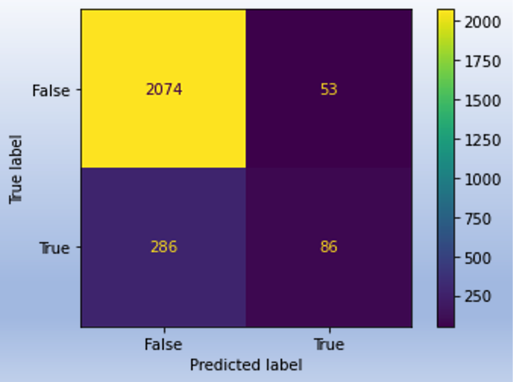
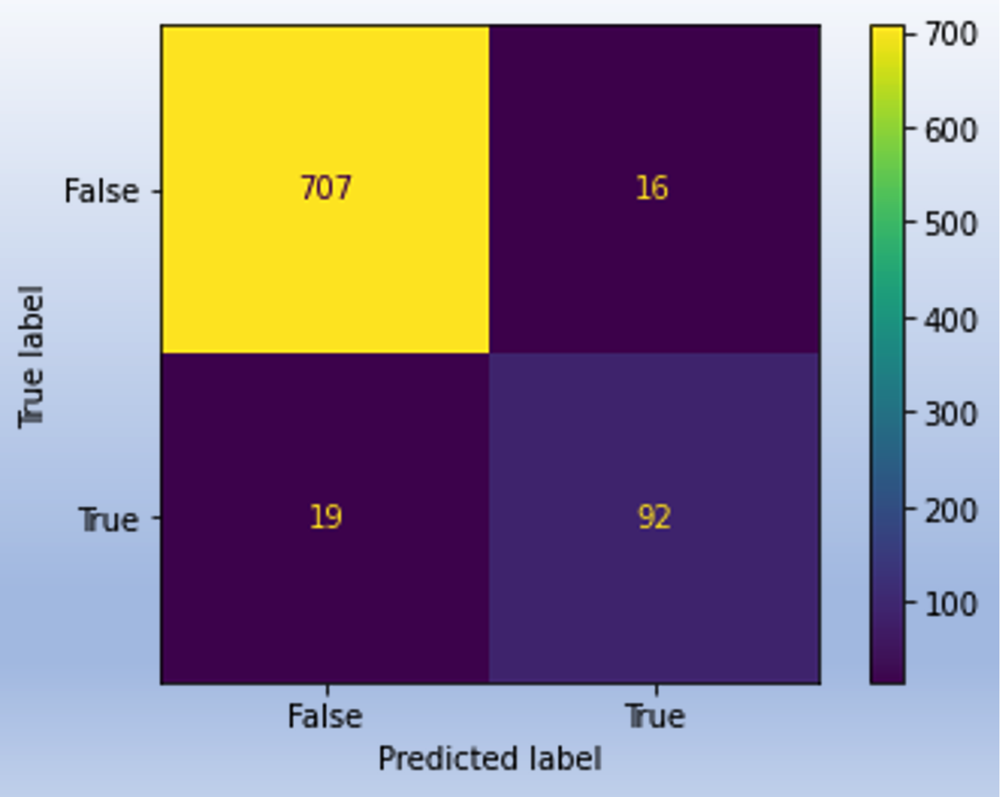
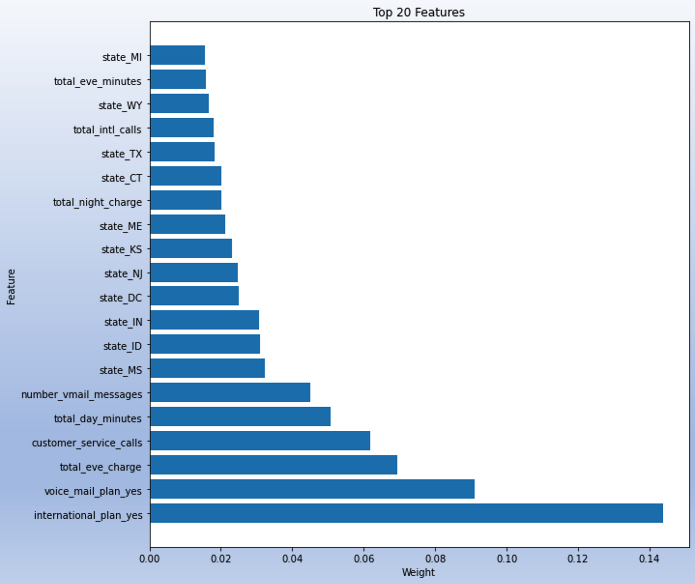

# SyriaTel Churn Rate Machine Learning Project

**Authors**: Brian Matsiko, George Ferre

## Overview

This project creates a machine learning model that is able to predict the SyriaTel customers that are most likely to churn. Data for this project was sourced from the Kaggle website.The dataset includes 33 features and over 3,000 data points.


## Business Problem

***
* Syria Tel is a telecom company that provides service in United States
* Churn rate of ~15%
* Need to identify customer likely to leave
* Opportunity for proactive engagement and business retention
***

### Exploratory Data Analysis
The dataset churn has two categories:
* True = Customer churn.
* False = Customer won’t churn.

###### Customer Client Churn by State


###### Collinear Plot
‘Total day minutes’ and ‘total day charges’ are highly correlated
‘Total eve minutes’ and ‘total eve charges’ are highly correlated
‘Total night minutes’ and ‘total night charges’ are highly correlated
‘Total intl minutes’ and ‘total intl charges’ are highly correlated


## Methodology

* Model development was initialized with the logistric regression model. 
* The recall score metric formed the basis for further development and optimization during the subsiquent model development.
* Iterations were made from logistic regression to KNN, Random Forest and XGBoost models.
* XGBoost was selected and optimized as the final model.

***

###### Baseline Model


###### Final Model

***


## Conclusions

###### Final Model Important Features



Using the data provided, we were able to create a model with 85% recall, meaning of the customers who are going to leave, we are able to identify 85% of them. We were able to do this while maintining a high accuracy of 95%.
Based on the feature importance we can determine that churn can be influenced by:
1. **If the customer has an international plan.**
2. **Voice mail plan and number of voicemail messages.**
3. **Customer Service Calls.**
4. **Total day charge.**

We can also see that a lot of states seemed to have made it into the top 20. Based on this information, we would recommend the following:

1. **Further investigation into needs of international plan customers. Consider if there is a move to online forms of communication for international users (Skype, Discord, Google Chat, FaceTime). See if more robust dataplans can be used**
2. **Audit Customer Service Calls. Make sure cusotmers are being helped. If the model identifies a customer likely to leave, it may be worth checking if they have called in recently.**
3. **Check to make sure rates are competitive in a given area. With total day charge as a significant factor in our model, it is worth making sure that rates are competitve, especially in states with higher churn.**

Finally, moving forward we can do the following:
1. **Fix issue with area code data. This can help us determine geographic churn at a more granular level. (Worth noting that since these are not landlines there is not a 100% relation to customer area and area code, but can still be good for approximation).**
2. **Look into call center statistics. Currently we only know how many times a customer may have called, but we should try to get more information such as customer satisfaction, call time, need for escalation, etc.**
3. **Get more information about customer accounts. Currently we only have call data, we should know more about texting and data options as well. We can also see how many lines are on a given account.**

## For More Information

Please review our full analysis in [our Jupyter Notebook](./Final_Submission.ipynb) or our [presentation](./SyriaTel_Churn_presentation.pdf).

For any additional questions, please contact **Brian Matsiko matsikobrian@yahoo.com, George Ferre georgeaferre@gmail.com**.

## Repository Structure

Describe the structure of your repository and its contents, for example:

```
├── README.md                         
├── Final_Submission.ipynb  
├── SyriaTel_Churn_presentation.pdf         
├── Scrapbooks                         
└── images
```


