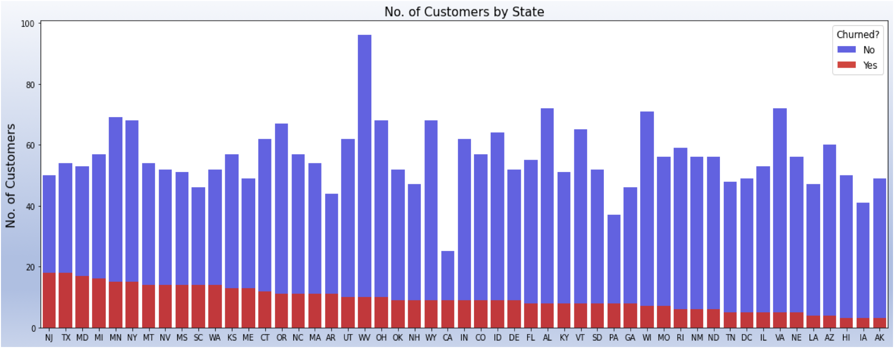
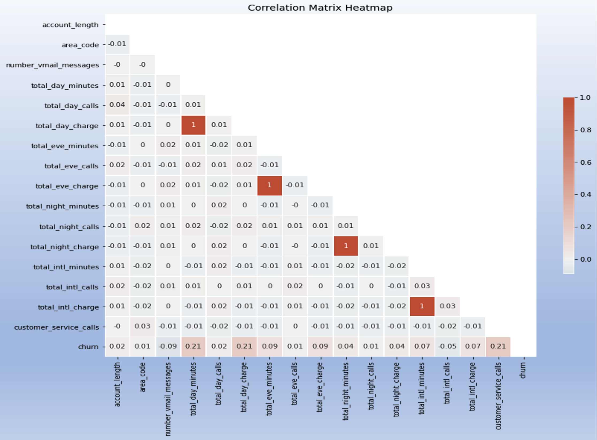

# SyriaTel Churn Rate Machine Learning Project

**Authors**: Brian Matsiko, George Ferre

## Overview

This project creates a machine learning model that is able to predict the SyriaTel customers that are most likely to churn. Data for this project was sourced from the Kaggle website.The dataset includes 33 features and over 3,000 data points.

## Business Problem

***
* Syria Tel is a telecom company that provides service in United States
* Churn rate of ~15%
* Need to identify customer likely to leave
* Opportunity for proactive engagement and business retention
***

### Exploratory Data Analysis
The dataset churn has two categories:
* True = Customer churn.
* False = Customer won’t churn.

###### Customer Client Churn by State


###### Collinear Plot
‘Total day minutes’ and ‘total day charges’ are highly correlated
‘Total eve minutes’ and ‘total eve charges’ are highly correlated
‘Total night minutes’ and ‘total night charges’ are highly correlated
‘Total intl minutes’ and ‘total intl charges’ are highly correlated


## Methodology

* Model development was initialized with the logistric regression model. 
* The recall score metric formed the basis for further development and optimization during the subsiquent model development.
* Iterations were made from logistic regression to KNN, Random Forest and XGBoost models.
XGBoost was selected and optimized as the final model.

***

###### Baseline Model


###### Final Model

***


## Conclusions

###### Final Model Important Features


This analysis leads to the following recommendations for creating a movie.
1. **Customer Service Calls.**
Establish Customer Service Calls audit program for continuous improvement
2. **Market Performance.**
Perform a market study to help understand how we can more competitive.
3. **Data plans.**
 Evaluate effectiveness of data plans  specifically for our international customers

## Project Limitations

Further analyses could provide even more insight into how you will create and distribute Microsoft's first movie:

**Customer churn rate coverage.**
Factors responsible for the different state churn rates not covered

**Area Codes.**
Dataset had only three unique area codes. Area code feature was dropped

**Call Rates.**
Assumed that rates were charged per time period.

**Customer Service Calls.**
Not able to perform in-depth analysis on the details here.

## For More Information

Please review our full analysis in [our Jupyter Notebook](./Final_Submission.ipynb) or our [presentation](./SyriaTel_Churn_presentation.pdf).

For any additional questions, please contact **Brian Matsiko matsikobrian@yahoo.com, George Ferre georgeaferre@gmail.com**.

## Repository Structure

Describe the structure of your repository and its contents, for example:

```
├── Syria_Churn_Rate_README.md                         
├── Final_Submission.ipynb  
├── SyriaTel_Churn_presentation.pdf         
├── Scrapbooks                         
└── images
```

